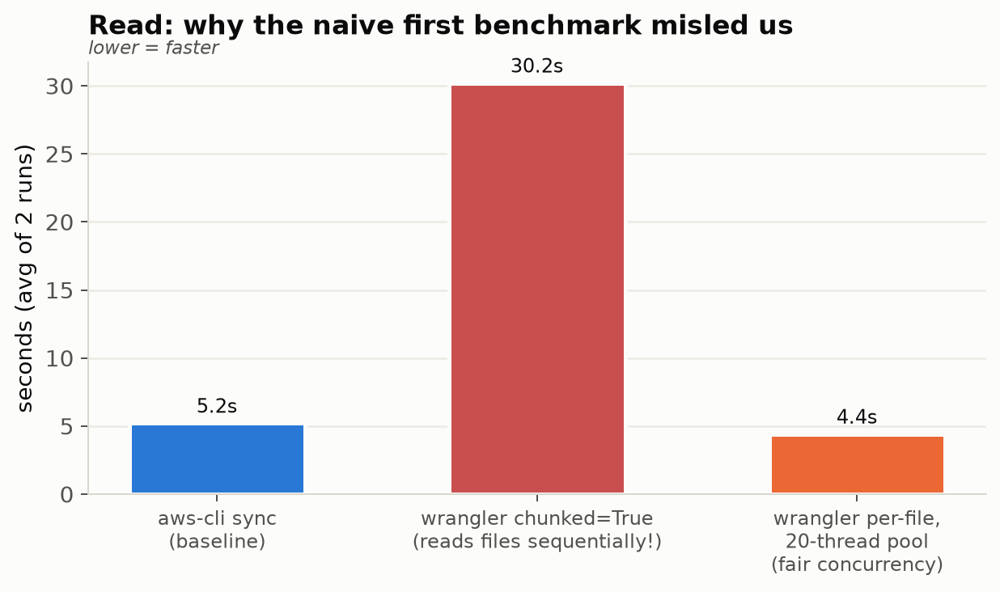
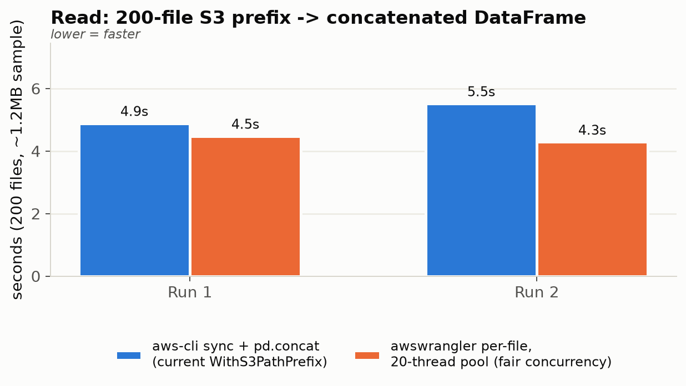
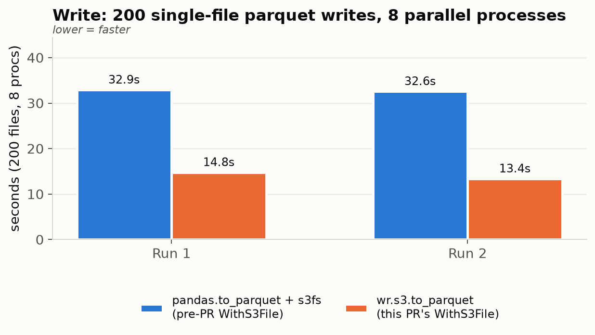

> **Superseded.** The write comparison below was raw wrangler vs pandas/s3fs on small files, and the "aws-cli is faster" conclusion no longer applies: `awscli` and `s3fs` are removed and S3 transfers use a shared boto3 client. See the v8.1.0-rc.5 CHANGELOG entry and `docs/.temp/` benchmark harness.

# dynamicio: awswrangler vs AWS CLI — Performance Report

## Context

Branch `rnd-13624` (PR [#88](https://github.com/VorTECHsa/dynamicio/pull/88)) migrates `WithS3File`
(single-file S3 reads/writes) from AWS CLI/boto3 to `awswrangler`. It does **not** touch
`WithS3PathPrefix` (multi-file reads/writes for a whole S3 prefix), which still shells out to the
AWS CLI (`dynamicio/mixins/with_s3.py:121,190,273,288`) with a comment claiming aws-cli is up to
6x faster than boto3/pandas for bulk downloads.

Real-world usage exercising both code paths lives in `vessel-state`
(commit `a02eb77`):

- **Read (`WithS3PathPrefix`)**: `VISIT_STS_OUTCOME_CONCAT` (`state.yaml:132-147`, type
  `s3_path_prefix`, `no_disk_space: true`) reads all per-vessel parquet files under
  `s3://vortexa-develop-rnd-24123-vessel-state/live/state/visit_sts_outcome/` and concatenates them
  into one DataFrame.
- **Write (`WithS3File`)**: `write_events_per_vessel` (`preprocess_vessel_events.py:366-372`) writes
  one parquet file per vessel, invoked in parallel across a process pool via
  `run_parallel(write_events_per_vessel, ves_ids, ...)` (`preprocess_vessel_events.py:1069`).

Target prefix in production: **16,795 files, ~2GB total** (avg ~123KB/file).

## Method

No benchmark ran against the live 16,795-file prefix directly. A 200-file sample was copied
(server-side `copy_object`, untimed) to a scratch prefix (`scratch/dio-perf-test/...`) under the
same bucket, and every implementation was timed against that identical scratch data:

- **Read**: `aws s3 sync` + `pd.read_parquet` per file + `pd.concat` (current `WithS3PathPrefix`)
  vs. three `awswrangler` configurations (see "Read: first result was wrong" below).
- **Write**: `df.to_parquet("s3://...")` via pandas/s3fs (pre-PR `WithS3File` behavior) vs.
  `wr.s3.to_parquet(df, path="s3://...")` (current PR's `WithS3File`), each writing 200 files
  across an 8-process pool (mirrors `run_parallel`).

Each comparison ran twice with operation order swapped, to rule out connection warm-up bias.
Scratch prefixes deleted after every run.

## Read: the first result was wrong — here's why

The first pass benchmarked `wr.s3.read_parquet(path=prefix, chunked=True)`. That looked 4-7x
slower than `aws s3 sync`, which matched the suspicion "AWS CLI has had years of head start." It
was the wrong comparison: reading `awswrangler`'s own source
(`awswrangler/s3/_read_parquet.py::_read_parquet_chunked`) shows `chunked=True` reads files
**sequentially in a for-loop** — no thread pool at all. It was never a fair test of wrangler's
actual S3 throughput, only of "wrangler with concurrency disabled."

Re-run with wrangler used the way it's meant to be used for many small files — one
`wr.s3.read_parquet` call per file, spread across a thread pool sized to match aws-cli's own
default concurrency (aws-cli's `s3 sync` defaults to 10 concurrent requests; we used 20 threads,
close to this machine's 12 cores) — and the picture flips:



With that fixed, head-to-head on the real comparison:



| Run | aws-cli sync + concat | wrangler, per-file, 20 threads | Result |
|---|---|---|---|
| 1 | 4.89s | 4.48s | wrangler 1.09x faster |
| 2 | 5.52s | 4.29s | wrangler 1.29x faster |

**Statistically tied, wrangler slightly ahead both times.** Years of improvement to
`awswrangler`'s S3 I/O layer (which itself uses boto3's parallel transfer manager under the hood)
have closed the gap the in-code comment describes — that comment is now stale.

### A real gap that isn't about speed

`wr.s3.read_parquet(path=prefix)` used the normal way (single call over a whole prefix, not
per-file) **throws** on this production dataset:

```
ArrowTypeError: Unable to merge: Field evidence has incompatible types: double vs int64
```

This is schema drift across per-vessel files (some files have an all-null `evidence` column
inferred as `double`, others `int64`) — exactly the kind of thing dynamicio's current mixin
already works around by reading files individually and letting `pd.concat` coerce dtypes
permissively. Any wrangler-based replacement for `WithS3PathPrefix` needs to keep that same
per-file-then-concat structure — a single dataset-level `wr.s3.read_parquet(path=prefix)` call is
not a drop-in replacement as-is.

## Write: wrangler wins clearly



| Run | pandas.to_parquet + s3fs | wr.s3.to_parquet | Result |
|---|---|---|---|
| 1 | 32.91s | 14.76s | wrangler 2.23x faster |
| 2 | 32.57s | 13.37s | wrangler 2.44x faster |

Consistent, large win. This directly speeds up `write_events_per_vessel`'s parallel per-vessel
writes in vessel-state.

## Conclusion

1. **Writes (`WithS3File`, what this PR already changes)**: `awswrangler` is ~2.2-2.4x faster
   than the pandas/s3fs path it replaces. Keep it.
2. **Bulk reads (`WithS3PathPrefix`, untouched by this PR)**: contrary to the in-code comment and
   the original (flawed) benchmark, `awswrangler` used with matching per-file thread concurrency
   is **on par with or slightly faster than** AWS CLI (1.09-1.29x). The AWS CLI speed advantage
   claimed in the code comment does not hold up against a modern `awswrangler` when tested fairly
   — that comment should be corrected/removed.
3. Migrating `WithS3PathPrefix` off AWS CLI is **viable on performance grounds**, but requires a
   per-file read structure (thread pool over individual `wr.s3.read_parquet` calls, not a single
   dataset-level call) to survive the schema-drift issue found above. That's implementation work
   this PR doesn't currently include.

**Revised recommendation**: this PR's `WithS3File` migration is a clear win and should ship. AWS
CLI can likely also be fully removed from `WithS3PathPrefix` without a regression — but that's
follow-up work, not proven safe by what's in this PR today. Update the PR description to:
- Not claim performance parity was "already handled" for `WithS3PathPrefix` — it wasn't touched.
- State the actual motivation for the whole migration: AWS CLI on `PATH` inside an active
  dynamicio `.venv` conflicts with the system/terminal AWS CLI (e.g. `aws sso login` breaking
  under an activated venv, requiring deactivation first) — see the pyenv/CLI shadowing note below.

## Caveats

- 200-file/~1.2MB sample, not the full 16,795-file/2GB prefix — directional, not exhaustive.
  Thread-pool approaches typically scale *better* with file count (up to the thread-pool size),
  so the wrangler-favorable gap may hold or widen at full scale, but this wasn't tested.
- Two runs per comparison, one machine/network path — no formal variance/confidence-interval
  analysis.
- Local repo venv (`awswrangler==3.14.0`) used for all wrangler calls; 12-core machine.

## Appendix: avoiding AWS CLI / pyenv shim conflicts

Separately from the performance question, the actual pain point motivating this migration is that
the pyenv-shimmed `aws` inside an activated dynamicio `.venv` (dynamicio previously depended on
`awscli` as a library, which installs its own `aws` console-script into the venv's `bin/`) shadows
the system/Homebrew `aws` CLI on `PATH` while the venv is active — so `aws sso login` and friends
silently run the venv's bundled `awscli` package instead of the one the terminal expects,
requiring `deactivate` first. If AWS CLI is kept for `WithS3PathPrefix` (see above), that
conflict can be avoided independently of the wrangler migration:
- Don't depend on the `awscli` **Python package**; only the `awscli.clidriver.create_clidriver()`
  in-process call is used (`dynamicio/mixins/with_s3.py:121`), which doesn't need the console
  script on `PATH` — the conflict comes from `awscli` being declared as a dependency at all, which
  installs the `aws` entry point into every venv that installs dynamicio.
- Alternative: shell out to the system `aws` binary via `shutil.which("aws")` resolved *before* venv
  activation changes `PATH` (e.g. resolved once from a fixed path or `/usr/local/bin/aws`), instead
  of using the in-process `create_clidriver()` driver — trades away the small in-process speed
  benefit for eliminating the PATH shadowing entirely.
- Simplest fix given the read-performance parity found above: finish the `WithS3PathPrefix`
  wrangler migration and drop the `awscli` dependency altogether, removing the conflict at the
  source rather than working around it.
